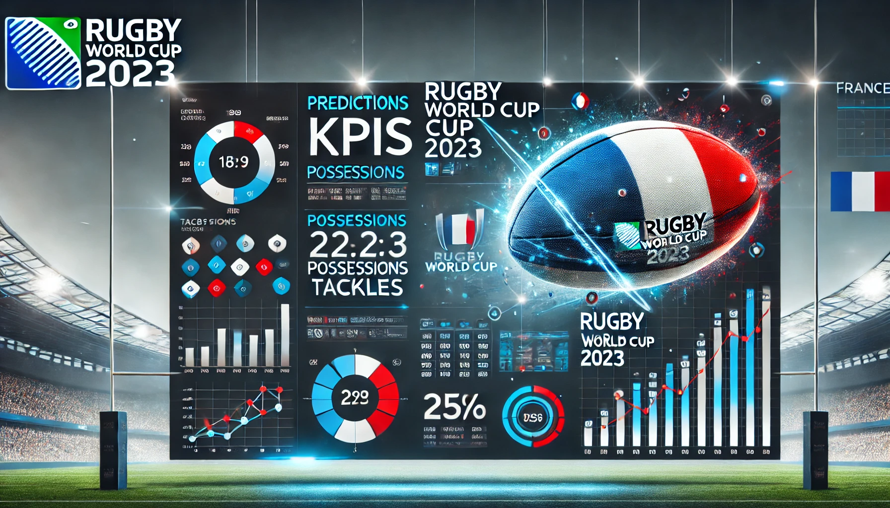
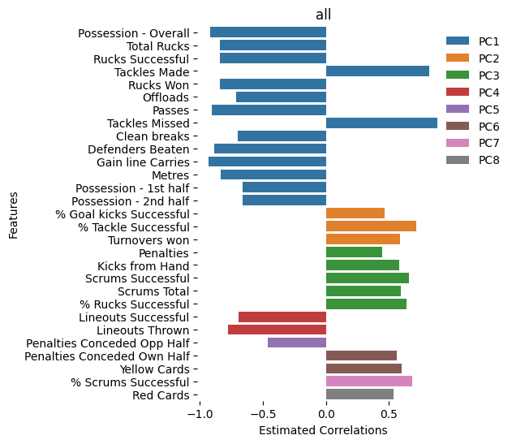
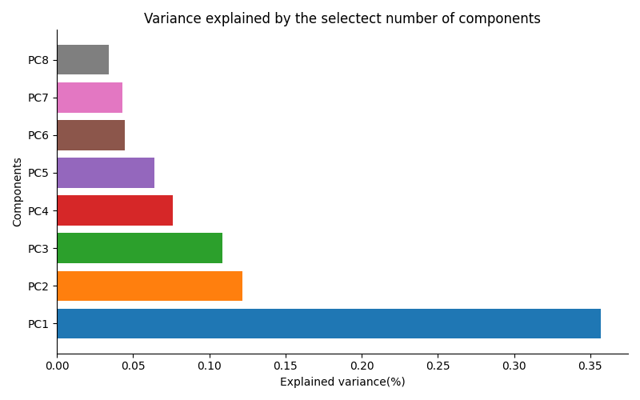
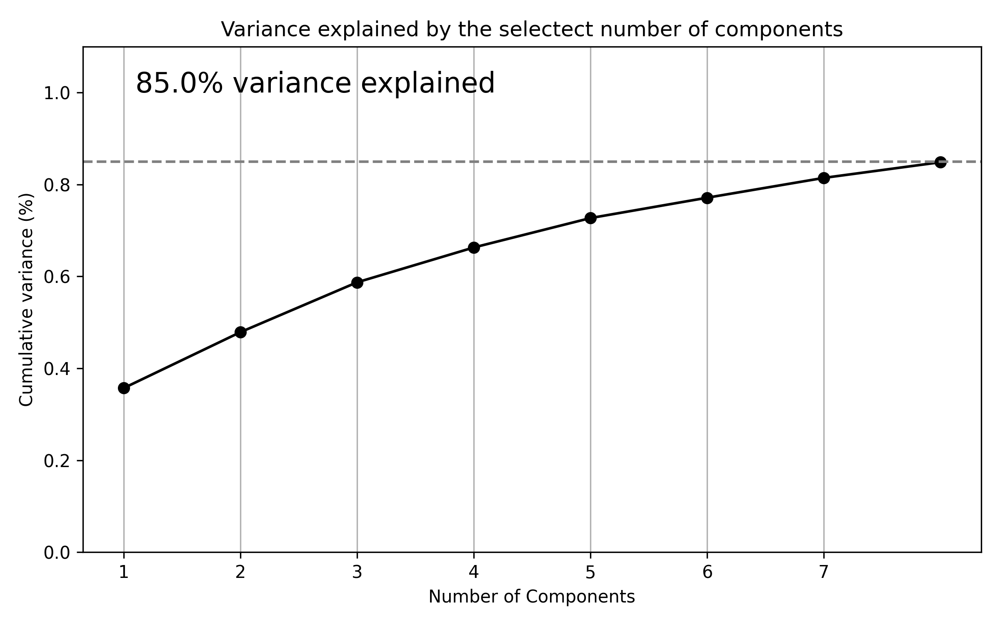
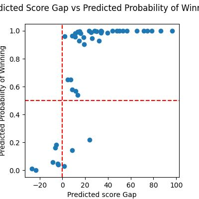
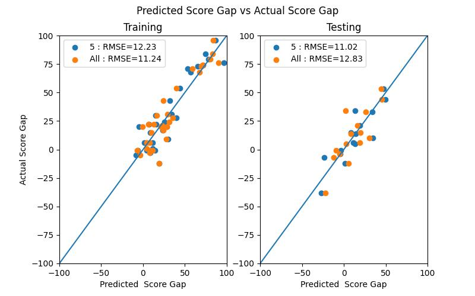

  

# Predicting Outcomes and Scores in Rugby World Cup 2023

## Technologies Used

  
  

## Overview
This project focuses on leveraging machine learning techniques to predict match outcomes (win/loss) and score differences in rugby games from the Rugby World Cup 2023. Additionally, the study explores key performance indicators (KPIs) that influence these outcomes using principal component analysis (PCA).

The goal of this project is to provide valuable insights for rugby analysts, coaches, and enthusiasts by identifying patterns and relationships in the data that are not immediately apparent. By combining statistical rigor with machine learning, the project offers a comprehensive approach to understanding and predicting match outcomes.

## Features
- **Outcome Prediction**: Using logistic regression to predict whether a team wins or loses.
- **Score Difference Prediction**: Employing regularized regression methods to predict the margin of scores between teams.
- **KPI Analysis**: Analyzing the impact of different KPIs on match results using PCA.
- **Custom ELO System**: Development and evaluation of an ELO rating system tailored for rugby matches.

## Data Source
The dataset comprises match data from the Rugby World Cup 2023, including team performance metrics and match results. Additional data sources include scraped historical match results and betting odds collected from various platforms.

## Project Structure
1. **Final Report**: A comprehensive PDF report summarizing the findings and methodology.
2. **Notebooks**: Four Jupyter notebooks detailing the step-by-step analysis and modeling process.
    - **PCA_study**: The main analysis focusing on KPI analysis using PCA.
    - **elo_rugby_creation**: Creation of an ELO rating system from historical match results.
    - **elo_rugby_analysis**: Analysis and evaluation of the ELO rating system.
    - **wiki_scrap_all_games**: Data scraping from Wikipedia to collect historical match results.
    - **odds_import_df**: Collection and analysis of odds from a betting website to evaluate the ELO system.

## Key Findings

### Principal Component Analysis (PCA):

  - 29 performance indicators from Rugby World Cup 2023 data were reduced to 8 principal components, explaining 84.85% of the dataset's variance.
  - Key components identified include:
    - Possession (36% variance explained): Metrics related to ball control, such as possession time and successful rucks.
    - Quick Breaks and Defense (12%): Metrics tied to tackles, turnovers, and clean breaks.
    - Territory Control (11%): Focus on successful scrums and territorial kicks.

### Logistic Regression (Match Outcome Prediction):

- Logistic regression using all components achieved a 100% win prediction accuracy on the test set but struggled with -losses, correctly predicting only 50% of them.
- Components 2 (Quick Breaks and Defense) and 3 (Territory Control) significantly impacted the odds of winning:
- Component 2: 897% increase in winning probability per unit increase.
- Component 3: 587% increase in winning probability per unit increase.

### Linear Regression (Score Difference Prediction):

- Regression using selected components yielded an R² of 0.84 with an RMSE of 12.83 on the test set.
- The model performed well predicting wins but struggled with losses, especially in closely contested games.

### Insights on Game Tactics:

 - Teams focusing on fewer rucks, more clean breaks, and turnovers, as well as effective territorial kicks, had higher winning probabilities.
 - Tactical emphasis on components like defensive actions and ground play efficiency contributed significantly to success.

Contribution of KPIs to Components

Variance Explained by Each Components

Components Selected for Analysis

Comparative Results Using Gap Score Predictions and Outcome Predictions

Model Performance for Score Prediction

## Challenges and Recommendations
Class imbalance and overrepresentation of strong teams in the dataset impacted model performance.
Future studies should expand the dataset to include matches from multiple tournaments to improve model robustness.
PCA, combined with regression models, provides a structured approach to identifying impactful performance indicators but requires further refinement for practical applications.

## Contribution
Contributions are welcome! Feel free to fork the repository and submit a pull request with your improvements. Suggestions for additional analyses, new features, or enhanced visualizations are highly encouraged.

We hope this project inspires further research and collaboration in the exciting intersection of sports and machine learning!
